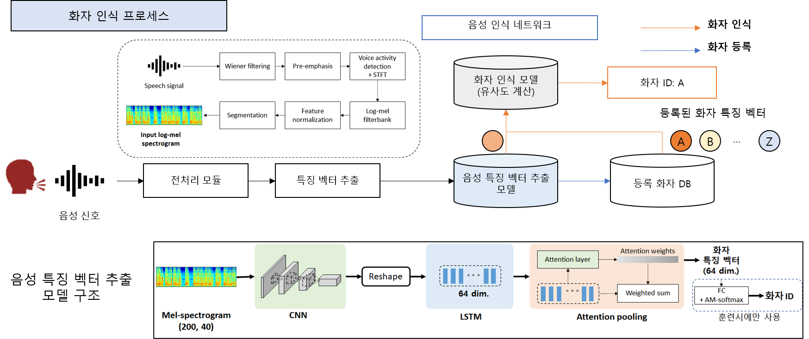

[Flagship] speaker recognition module
======================

#### 0. Note

* (2020/4/29) 4월 마스터 버전이 업데이트 되었습니다.
* (2020/5/29) 5월 마스터 버전이 업데이트 되었습니다.
> 7개의 화자로 구성된 전체 샘플(각 class당 10개, 총 70)에 대한 테스트 코드 첨부하였습니다.

#### 1. 서버 환경

* OS : Ubuntu 16.04
* GPU driver : Nvidia CUDA 9.0

#### 2. System/SW Overveiw

* 개발 목표: 새로 입력된 화자에 대하여 음성, 영상 화자 인식기를 이용하여 별다른 로그인 없이 누구인지 맞출 수 있어야 한다.
* 최종 결과물:
 

#### 3. How to install

> pip install -r requirements.txt

#### 4. Main requirement

* Python 3.5.2
* tensorflow-gpu 1.12.0
* Keras 2.2.4

#### 5. Network Architecture and features

* **Model:**
* We used CRNN-attention based lightweight network.

* **Metrics:**
* Accuracy computed using verification score
* Each speech segment extracts 64-dimensional features through the network
* It uses **cosine similarity** and is calculated by dividing the absolute value by the dot product.
* It has a value from -1 to 1 and uses the value to find the nearest speaker (The closer its value near 1, the more similar the target is.)

#### 6. Quick start

<!--* 2개의 방법으로 이용할 수 있다-->

##### 1. 터미널로 사용하는 이용하는 방법

> python app.py를 실행하고 주소가 실행됨을 확인한다 ex)http://127.0.0.1:5000/
> python Request.py를 실행하여 Input을 전달해주면 다음과 같은 response를 얻는다.
> * {"100001": "Voice Based Speaker Recognition - Speaker ID: OOOO"}

<!--##### 2. Web 상에서 이용하는 방법-->

<!--> python app_web.py를 실행한 후 생기는 주소로 들어간다.-->
<!--> "Try it out"을 눌러 Input 형식에 맞게 입력값을 넣어주고 실행시킨 후 response를 얻을 수 있다.-->

#### 7. HTTP-server API description

* Parameter

|Parameter|Type|Description|
|---|---|---|
|name|string|string of target's mp4 file name|
|path_dir|string|root path|
|re_register|string|when you've registered before, but the feature doesn't express you properly. you can use re_register=True| 

* Request

> '''
> data: {
> 'name': '이메일-번호.mp4'
> 'ip_address': 'http://0.0.0.0:5000/Identification_Request'
> 'path_dir': './upload'
> 're_register': 'False'
> }
> '''

* Response OK

> '''
> 200 success
> {
> "100001" : "Voice Based Speaker Recognition - Speaker ID: OOOO"
> }

#### 8. Repository overview

* 'utils/' -갤러리 저장, 존재여부, identification 코드
* 'data/' -타겟 데이터로 mp4형식으로 저장되어 있음
* 'best_model/' -model weight 파일
* 'gallery/voice_gallery' -화자가 처음 등록될 때 얻은 feature를 저장해두는 공간
